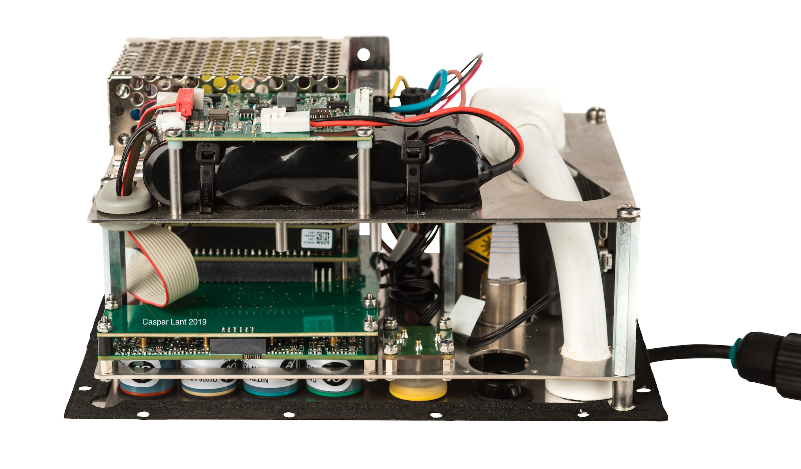
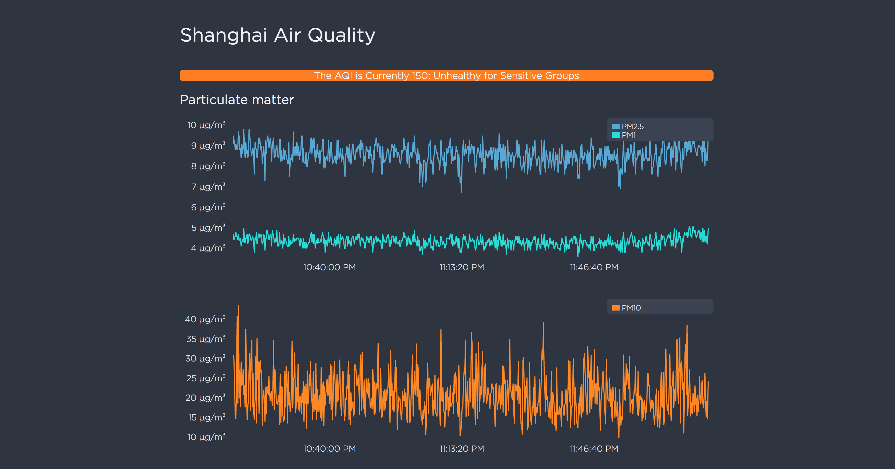
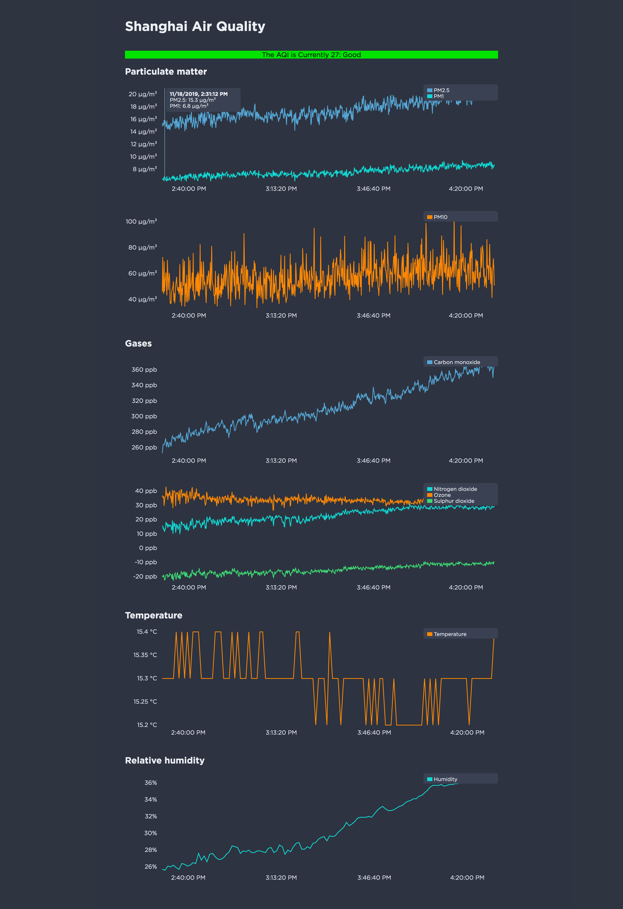
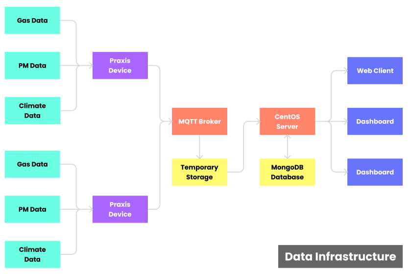

In August 2019, I installed two air quality monitors at the NYU Shanghai Campus. This was the culmination of a two-year long project funded by a \$10,000 [Green Grant](https://www.nyu.edu/life/sustainability/get-involved/green-grants.html) that I was awarded by the NYU Office of Sustainability. As project leader, I modified a design open-sourced by the U.N. Environmental Programme to give my monitors wifi- and remote-access capabilites. To help get the job done, I took on the role as a group leader at NYU's Tandon School of Engineering for the Smart Cities IoT Sensors Group, a team of six.

The project has been featured on NYU's [Twitter](https://twitter.com/nyutandon/status/1172201645733797888), [Linkedin](https://www.linkedin.com/posts/casparlant_nyu-activity-6577974547553755136-glLZ) and [Facebook](https://www.facebook.com/casparlant/posts/10220422089001717) pages, as well as in an [article](https://engineering.nyu.edu/news/summer-internships-provide-students-career-enhancing-opportunities?fbclid=IwAR3tn3-nOPaOFZoPS41lPyfxWHvmeBC8G2EmWCXfmqIUSTXtF68cnr2YJk4) published by Tandon.

We developed a web data-dashboard that displays live air quality information directly from the sensors in Shanghai: [airquality.engineering.nyu.edu](http://airquality.engineering.nyu.edu/) . The site is broadcasted continuously to two displays in the the NYU Shanghai campus in an effort to raise awareness about local air quality. The site updates every five seconds with measurements of particulate matter, climate, and greenhouse gases. We also display the live AQI (a more legible measure of air quality).

Currently, our team is working with the U.N. and the University of Nairobi to help them get set up with the web framework we developed for their own monitors.

<!-- and coordinate with the Smart Cities project's other    -->
<!-- I worked with the UNEP and Professor Kevin Cromar of the Marron Institute of Urban Mangagement to  -->

<!-- 

    <embed src="http://airquality.engineering.nyu.edu" width=100% height=800px />

 -->

You can find our group's most recent [project report here](https://docs.google.com/document/d/1Ki2vlGDsf7YYq9A7FM6ckWLvHiXE8sMqsR7v5EqkJS0/export?format=pdf). Below you'll find a diagram of the project's data insfrastructure.

<!-- The site updates every five seconds with measurements of particulate matter, climate, and greenhouse gases. We also display the live AQI (a more legible measure of air quality). [Come visit!](airquality.engineering.nyu.edu)

Currently, our team is working with the U.N. and the University of Nairobi to help them get set up with the web framework we developed for their own monitors. -->

<!-- The project has been featured on NYU's [Twitter](https://twitter.com/nyutandon/status/1172201645733797888), [Linkedin](https://www.linkedin.com/posts/casparlant-nyu-activity-6577974547553755136-glLZ) and [Facebook](https://www.facebook.com/casparlant/posts/10220422089001717) pages, as well as in an [article](https://engineering.nyu.edu/news/summer-internships-provide-students-career-enhancing-opportunities?fbclid=IwAR3tn3-nOPaOFZoPS41lPyfxWHvmeBC8G2EmWCXfmqIUSTXtF68cnr2YJk4) published by Tandon that I was featured in.   -->
