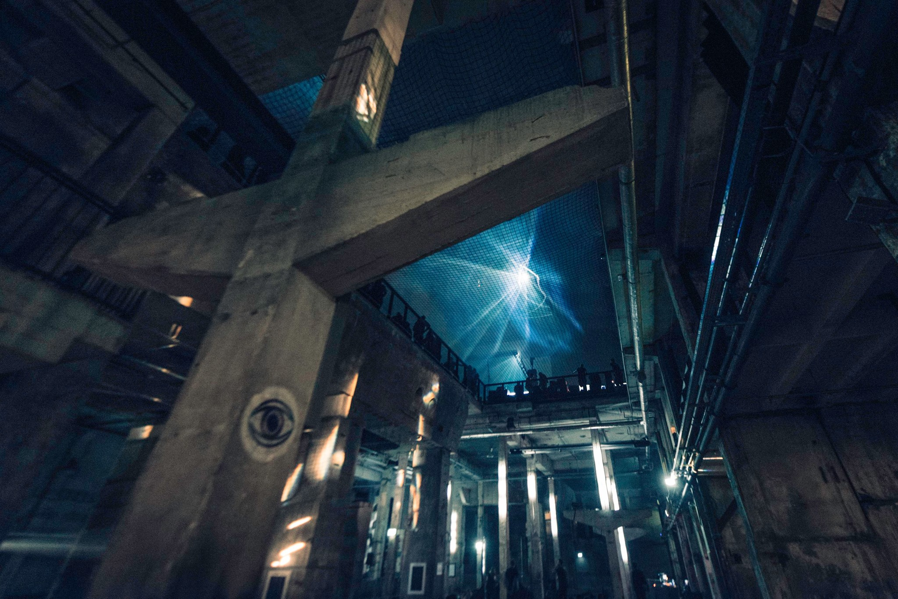
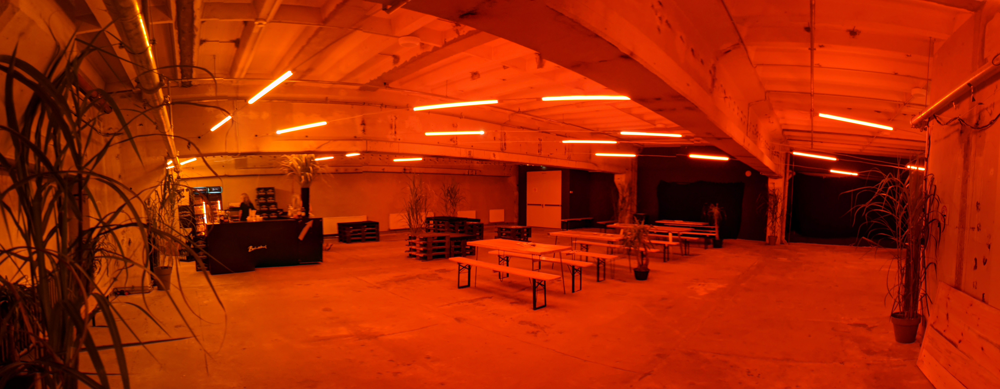

I was commissioned by [Berlin Atonal](http://berlin-atonal.com) for three consecutive years to design, construct, and operate light installations for their annual music and art festival at Kraftwerk Berlin, a massive dufunct East German power station.
##2017
In summer 2017 I mounted addressable white LED strips in aluminum gutters, and hung them facing the massive concrete pillars that permeate the space. I used max-MSP and VVVV to spacially map the location of each single LED pixel, and used this mapping to produce volumetric animations within the space.

</img>

<!-- 

</img>

</img>

 -->

##2018
For the next year of the festival, I did the lighting for the VIP bar area. This installation is static (ie, not animated) and features a gradual transition from red to orange across the room. The fixtures are mounted on tensioned cables and zig-zag across the space, congregating at the bar in the left corner.

</img>

https://www.instagram.com/p/BYWMang-Oq/?taken-by=caspie
