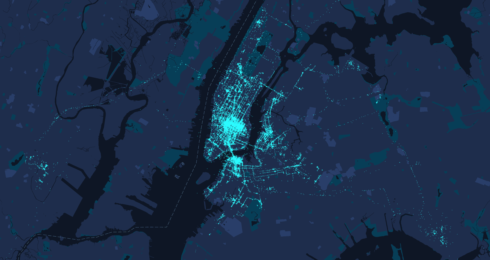
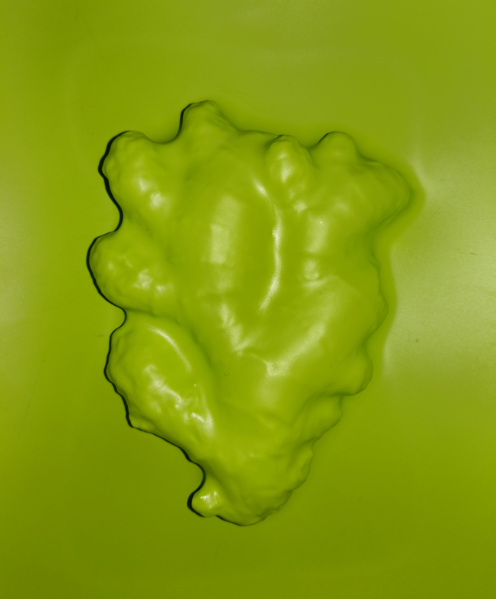
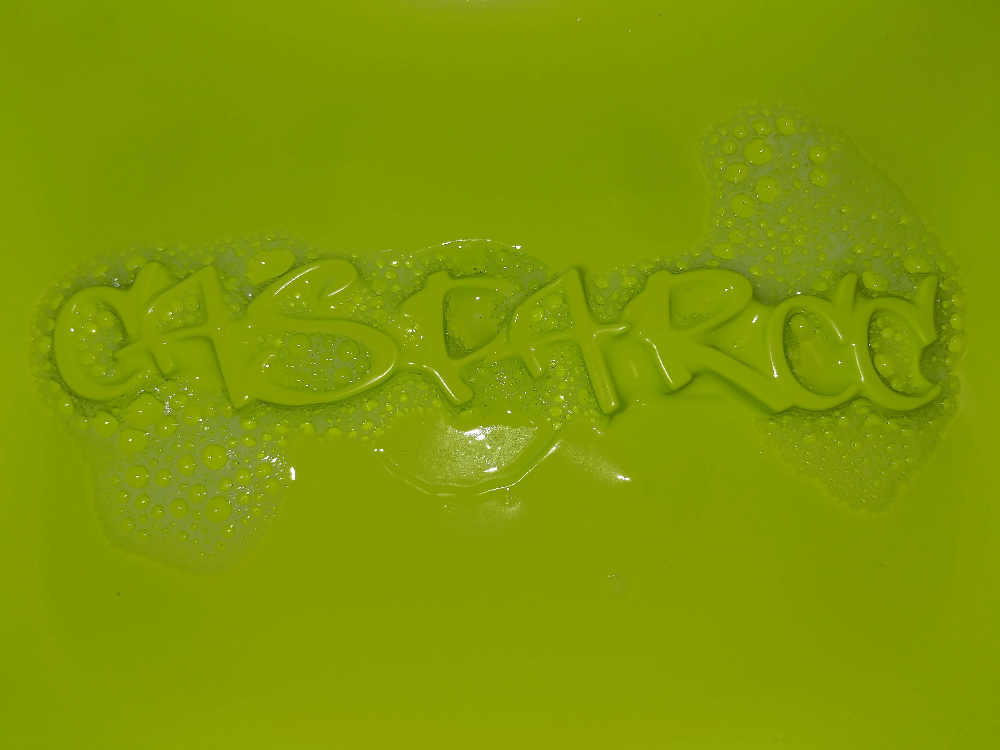
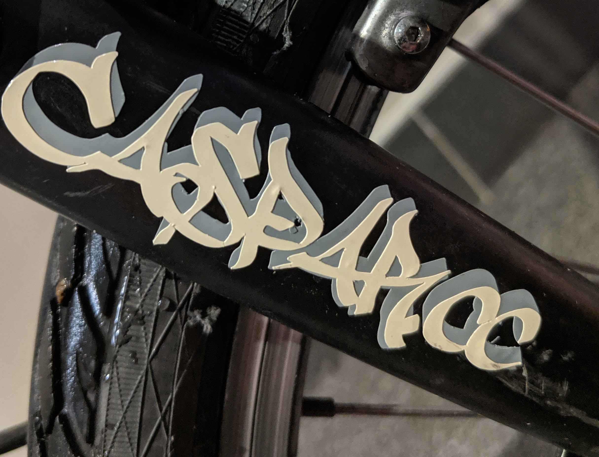
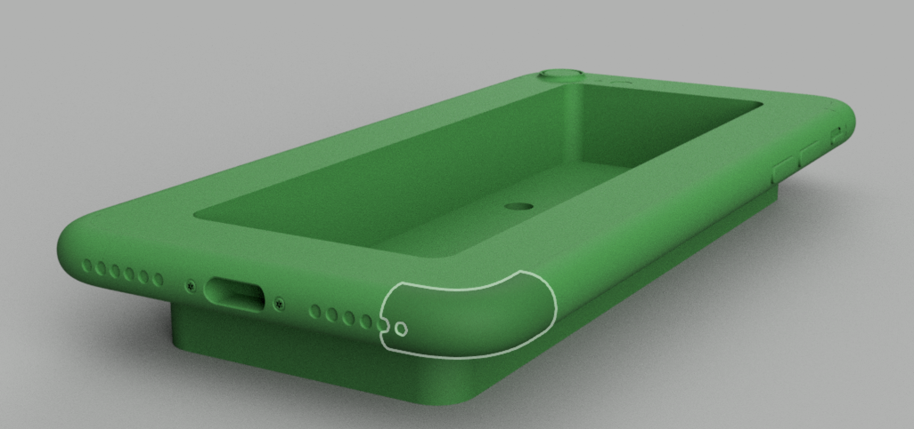
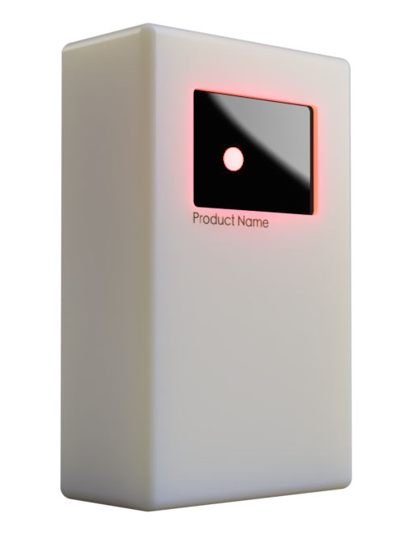
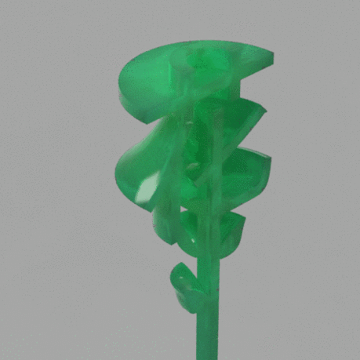
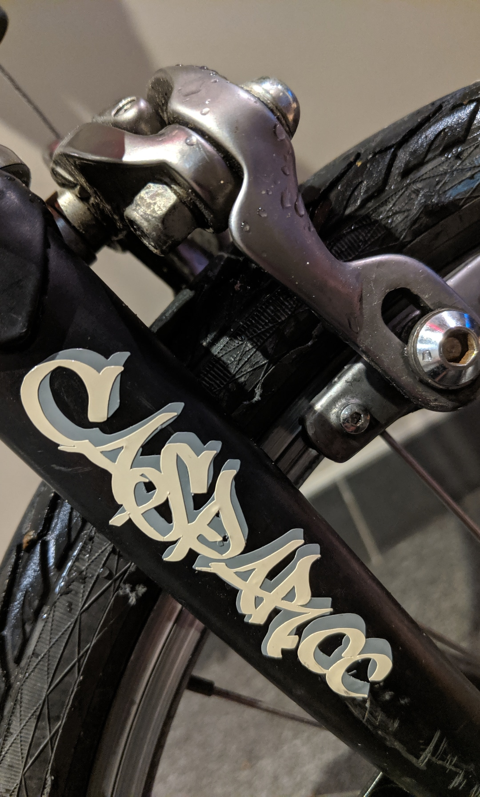

    <video width="100%" autoplay loop>
    <source src="hua-turntable-3.mp4" type="video/mp4"/>
    Your browser does not support the video tag :(
 </video>

**"花" (Huā)** - 3D printed flower (with chinese "flower" character). I originally made this as a thank you gift for one of my Chinese professors at NYU.

**personal heatmap** - Google logs my location continuously through the Maps app on my phone. I downloaded my location history from Google, and plotted it using Python and the Google Maps API. (These are my movements around New York City from 2015-2019.)

<!-- 

 -->

**vacuum-forming** - vacuum formed caspar.cc site logo.
(styrene thermoplastic, suction, soap bubbles)

**vinyl decal** - caspar.cc site logo.

**3D printed phone jig** - I designed these to support a custom phone case printing project. You attach a blank phone case to the jig and print an image onto it using a sublimation printer. This jig ensures that your print is squared up each time.

**"smarticus"** - an aftermarket smart fridge product that's still in the pipeline. This module sits in your fridge's door and keeps a list of its contents by reading the barcode of everything you put in and take out of your fridge. The biggest design challenge is keeping it powered.

<!-- <figure class="kg-card kg-gallery-card">
    

        

            

                
            

             

                
            

        

        

          

                
            

            

                
            

        

    

</figure> -->
