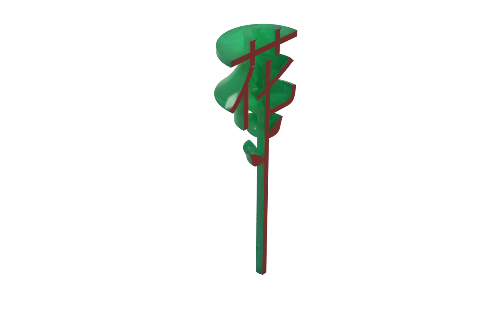

    <video width="100%" autoplay loop>
    <source src="hua-turntable-1.mp4" type="video/mp4"/>
    Your browser does not support the video tag :(
 </video>

**"花"** - 3D printed flower (with chinese "flower" character). I originally made this as a thank you gift for one of my Chinese professors at NYU.

**personal heatmap** - I log my location continuously with Google maps. These are my movements around New York City from 2015-2019.

**caspar.cc** - site logo vinyl bike decal for my Brompton. I made a decal that says "personal mobility device" for the other side so I can get it onto airplanes :)

**phone jig** - I made these iphone jigs for a friend's custom phone case printing project. I said he should post up in front of the SoHo Apple store on a nice day and sell them. You wouldn't even need a vendor's license if you sold them as artworks.

**"smarticus"** - aftermarket smart fridge product. This module sits in your fridge's door and keeps a list of its contents by reading the barcode of everything you put in and take out of your fridge. The biggest challenge is powering it.

<!-- <figure class="kg-card kg-gallery-card">
    

        

            

                
            

             

                
            

        

        

          

                
            

            

                
            

        

    

</figure> -->
