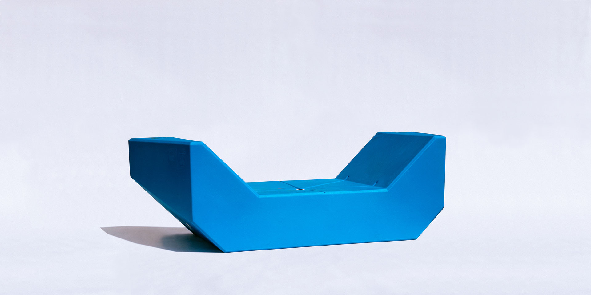
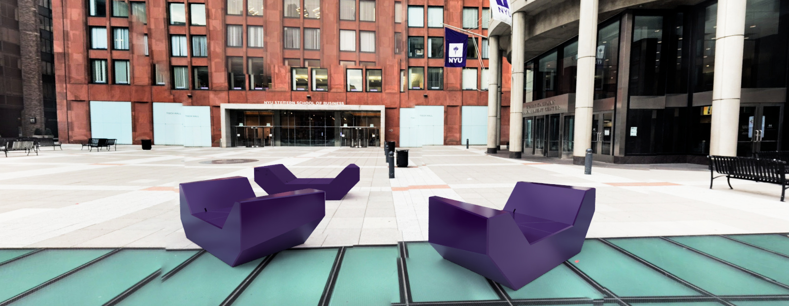

NYU suffers from a lack of unified communal identity that I feel is symptomatic of a lack of inviting outdoor spaces. As part of the 2019 Leadership Fellows cohort, I will bring inviting seating into Gould Plaza (below), an underutilized space at the physical center of NYU's Manhattan campus.

I am populating the plaza with brightly colored recycled plastic benches designed by to bring levity to the space.

