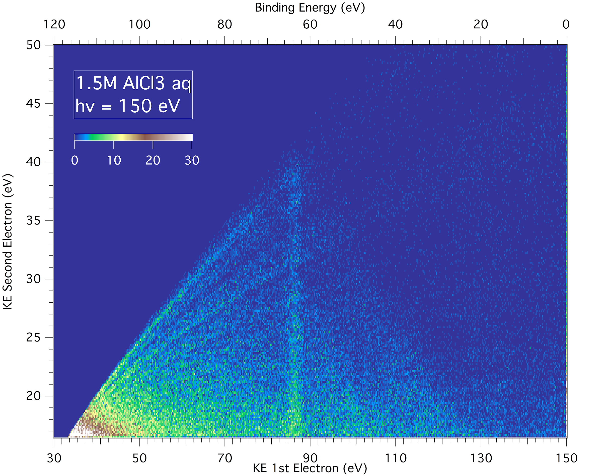
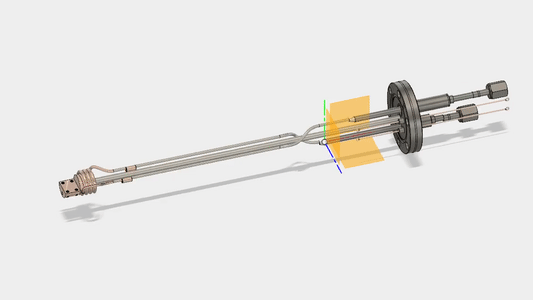
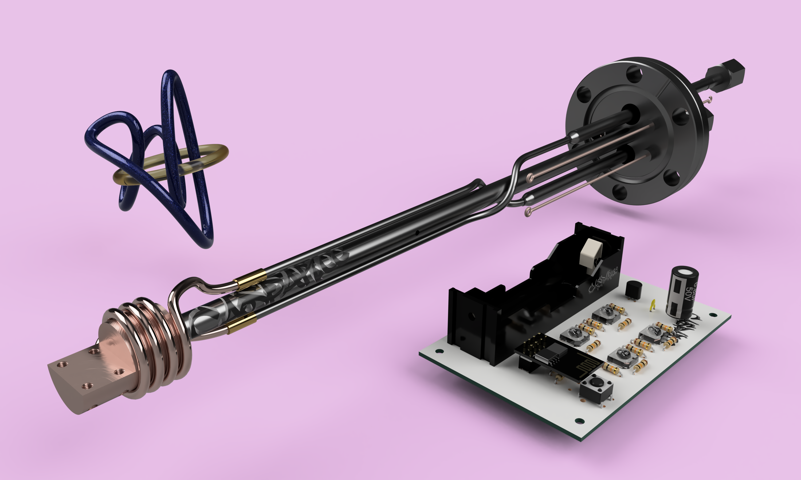

In 2017 I won a scholarship from the German Academic Exchange Service (DAAD) to do summer research at the Leibniz Institute of Surface Engineering (IOM) and Helmholtz Zentrum Berlin (HZB) with the Electron Spectroscopy Group. My summer began with a two-­week long experimental campaign at the BESSY II Synchrotron, where our group examined Interatomic Coulombic Decay (ICD) processes using time­-of­-flight (ToF) electron­e-electron coincidence spectroscopy on a liquid jet. I plotted these coincidences on a 2D ToF map using a custom Python script to determine the energies of ICD channels in our samples. I made figures for a poster presented at a Gordon Research Conference, on which I was an author.

<figure class="kg-card kg-image-card">

</img>

</figure>

Because the magnetic bottle spectrometer used during the experiment was home­brewed, we had only an anecdotal understanding of how changing its parameters would affect capture efficiency and energy resolution. I modeled the bottle in SIMION, an ion and electron optics simulator. The results will enable the group to establish bottle settings before future beamtimes, saving hours of calibration.

<figure class="kg-embed-card">

</img>

<!-- <figcaption>hi</figcaption> -->
</figure>

<!-- <figure class="kg-embed-card">

</img>
 
</figure> -->

Until now the group has been forced to use different experimental setups because of differing sample geometries (the liquid jet is linear, an ice sample is planar), whereas comparing measurements across different phases necessitates using the same setup. A proposed solution is to use a so­-called ice-­jet, which is a cold length of wire onto which one can deposit ice. Working independently, I designed a continuous-­flow nitrogen cryostat in CAD software and ran thermal­ and mechanical ­stress simulations before producing [technical drawings](Cryostat.pdf) and submitting them to a machine shop for manufacture.

<!-- <figure src='./Cryostat-Render-5.png'>
</figure> -->
