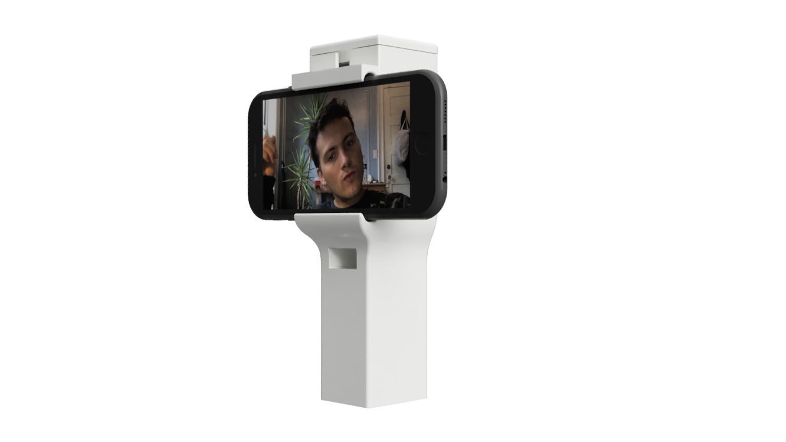

This device combats the opioid crisis by stemming the flow of prescription medication into the black market. A smartphone app pairs to this device via bluetooth and uses computer vision (face, hand, and pill detection) to ensure that the person prescribed a given medication is indeed the one who is taking it. Along the way, it prevents accidental overdoses and drug dependencies by dispensing pills only at regular intervals. 

