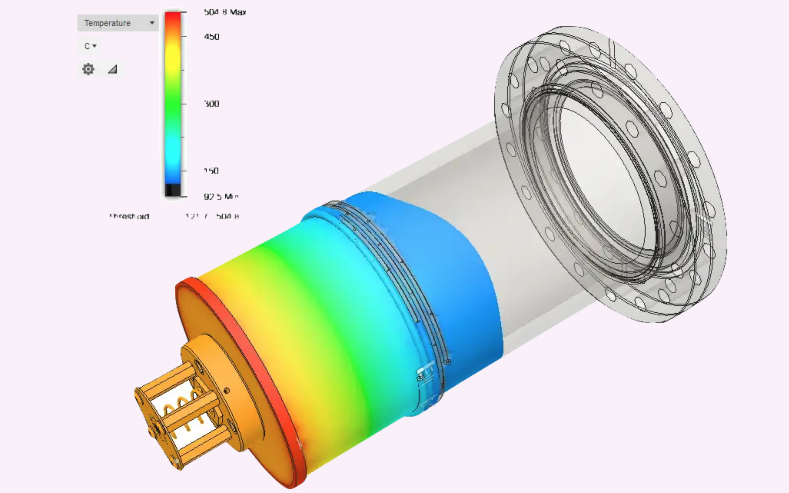

On a summer fellowship from the US Department of Energy at Oak Ridge National Laboratory, I worked for ten weeks with the [Surface Chemistry and Heterogeneous Catalysis Group](https://www.ornl.gov/group/scg), under [Dr. Aditya Savara](https://www.ornl.gov/staff-profile/aditya-ashi-savara).

I conducted complex molecular-beam experiments on perovskite crystals to characterize the surface kinetics of catalytic reactions of organic alcohols. Reactions of this type could eventually have industrial-scale applications in the production of biofuels. I also designed and fabricated an innovative ”heating enhancement” for our effusive molecular beam, **which may result in a patent**. I designed a [poster](./ornl-poster.pdf) (which will be presented at this year's American Chemical Society conference) detailing our results, and submitted a publication-length research [report](./ornl-report.pdf) to the Department of Energy.

</img>

A description of my summer research was included in an [article](https://engineering.nyu.edu/news/summer-internships-provide-students-career-enhancing-opportunities?fbclid=IwAR3tn3-nOPaOFZoPS41lPyfxWHvmeBC8G2EmWCXfmqIUSTXtF68cnr2YJk4) published by NYU.

</img>
</img>
</img>

