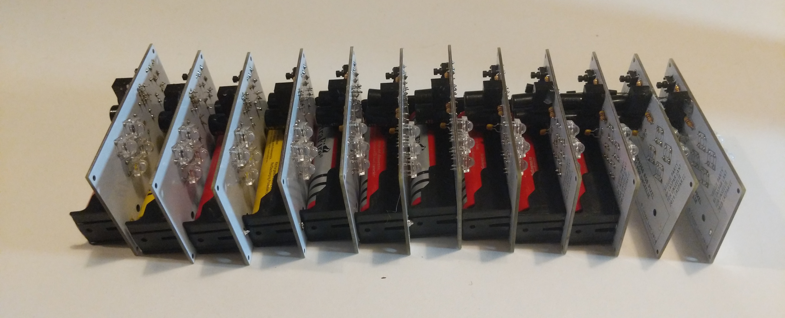

- Floating array of wireless RGB lights controllable by event attendees via web interface
- Vacuum-formed two-part moulds from large vegetables for light-di↵using enclosures
- Fabricated circuit boards with wireless microcontrollers running custom firmware

<!-- **jackfruit** -->

<!-- **yuca** -->

<!-- |||
|-|-|
|    ||
||| -->

<!-- <figure class="kg-card kg-gallery-card">
    

        

            

                </img>
            

             

                </img>
            

        

        

          

                
          

            

                
            

        

    

</figure> -->
