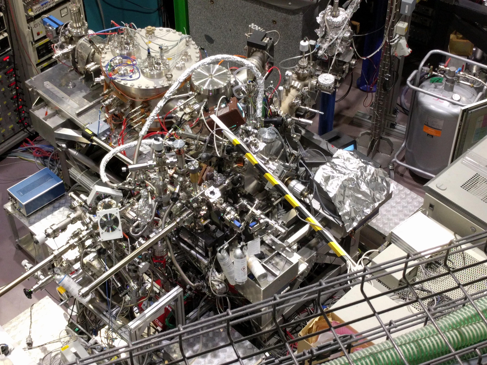

I spent one semester in Berlin at the Energy Materials In-situ Laboratory (EMIL). 

My work focused on growing thin-films of aluminum on monocrystalline silicon wafers via a vapor-deposition method known as sputtering. Here one bombards a "target" with ions under ultra-high vaccum, which produces a cloud of ejected vapor around the target. We can stick an aluminum substrate into this cloud and create a very thin (atoms thick) and very thin amorphous layer of a material--in our case silicon. We then annealed these samples and observed a process by which the silicon "creeps" through the aluminum substrate in a layer exchange process, and consequently adopts the crystalline structure of the aluminum. We found that this was a very cost-effective way to produce polycrystalline silicon samples, which are used everywhere from aerospace (solar panels) to computing (semiconductors)!

